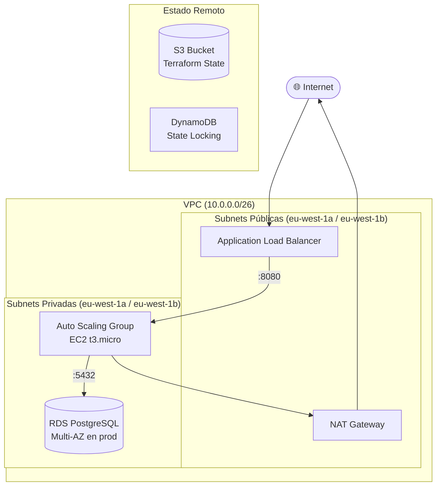

# 🌐 terraform-aws-portfolio

> 🇪🇸 [Español](#español) | 🇬🇧 [English](#english)

---

## Español

Infraestructura AWS modular, resiliente y de alta disponibilidad definida con Terraform.

Este proyecto demuestra buenas prácticas de IaC en un entorno real: separación por entornos (`dev` / `prod`), módulos reutilizables, gestión de estado remoto con S3 + DynamoDB, seguridad por capas y diferenciación de configuración entre entornos mediante lógica condicional.

### 🏗️ Diagrama de Arquitectura



> **Nota sobre el dimensionamiento de red:** Los rangos CIDR están definidos pequeños
> (VPC `/26`, subnets `/28`) de forma intencionada, ya que es un entorno de portfolio.
> En un entorno productivo real se dimensionarían según los requisitos del proyecto.

### 📁 Estructura del Proyecto

```
terraform-aws-portfolio/
├── environments/
│   ├── dev/                  # Entorno de desarrollo
│   │   ├── main.tf           # Declaración de módulos
│   │   ├── variables.tf      # Variables del entorno
│   │   └── outputs.tf        # Outputs expuestos
│   └── prod/                 # Entorno de producción
│       ├── main.tf
│       ├── variables.tf
│       └── outputs.tf
├── modules/
│   ├── networking/           # VPC, subnets, IGW, NAT Gateway, route tables
│   ├── compute/              # ALB, Launch Template, ASG, Auto Scaling Policy
│   ├── database/             # RDS PostgreSQL, DB Subnet Group
│   └── security/             # Security Groups, IAM Role, Instance Profile
└── scripts/
    └── bootstrap-state.sh    # Crea el bucket S3 y tabla DynamoDB para el estado remoto
```

### ⚙️ Diferencias entre entornos

| Configuración | `dev` | `prod` |
|---|---|---|
| Instancia EC2 | `t3.micro` | `t3.small` |
| ASG deseado | 1 | 2 |
| RDS Multi-AZ | ❌ | ✅ |
| RDS Storage Autoscaling | ❌ | ✅ |
| Deletion Protection | ❌ | ✅ |
| Backup Retention | 7 días | 30 días |
| Monitoring Interval | 60s | 30s |

### 🚀 Requisitos Previos

- Terraform `>= 1.6.0`
- AWS CLI configurado con credenciales válidas
- Cuenta AWS con permisos sobre EC2, RDS, VPC, S3, DynamoDB e IAM

### 📋 Uso

#### 1. Bootstrap del estado remoto (solo la primera vez)

```bash
cd scripts/
chmod +x bootstrap-state.sh
./bootstrap-state.sh dev
```

#### 2. Configurar la contraseña de la base de datos

```bash
export TF_VAR_db_password="TuPasswordSegura123!"
```

> ⚠️ Nunca incluyas contraseñas en el código fuente. En producción, usa AWS Secrets Manager.

#### 3. Desplegar el entorno

```bash
cd environments/dev/
terraform init
terraform plan
terraform apply
```

### 🧩 Módulos

| Módulo | Recursos que gestiona |
|---|---|
| `networking` | VPC, subnets públicas/privadas, Internet Gateway, NAT Gateway, route tables |
| `security` | Security Groups (ALB, EC2, RDS), IAM Role, Instance Profile |
| `compute` | Application Load Balancer, Launch Template, Auto Scaling Group, Scaling Policy |
| `database` | RDS PostgreSQL, DB Subnet Group |

### 🔒 Buenas Prácticas Aplicadas

- **Separación de entornos:** cada entorno tiene su propio estado remoto aislado
- **Módulos reutilizables:** misma lógica para dev y prod, diferenciada por variables
- **Seguridad por capas:** Security Groups separados por componente (ALB / EC2 / RDS)
- **Sin acceso público a base de datos:** RDS desplegada exclusivamente en subnets privadas
- **Cifrado en reposo:** `storage_encrypted = true` en todos los entornos
- **Variables sensibles:** `db_password` marcada como `sensitive = true`
- **Nomenclatura consistente:** `{proyecto}-{entorno}-{recurso}` en todos los recursos
- **Tags estandarizados:** `Project`, `Environment`, `ManagedBy`, `Owner` en todos los recursos

---

## English

Modular, resilient, and highly available AWS infrastructure defined with Terraform.

This project demonstrates real-world IaC best practices: environment separation (`dev` / `prod`), reusable modules, remote state management with S3 + DynamoDB, layered security, and per-environment configuration via conditional logic.

### 🏗️ Architecture Diagram


> **Note on network sizing:** CIDR ranges are intentionally small (VPC `/26`, subnets `/28`)
> as this is a portfolio environment. In a real production setup, they would be sized
> according to project requirements.

### 📁 Project Structure

```
terraform-aws-portfolio/
├── environments/
│   ├── dev/                  # Development environment
│   │   ├── main.tf           # Module declarations
│   │   ├── variables.tf      # Environment variables
│   │   └── outputs.tf        # Exposed outputs
│   └── prod/                 # Production environment
│       ├── main.tf
│       ├── variables.tf
│       └── outputs.tf
├── modules/
│   ├── networking/           # VPC, subnets, IGW, NAT Gateway, route tables
│   ├── compute/              # ALB, Launch Template, ASG, Auto Scaling Policy
│   ├── database/             # RDS PostgreSQL, DB Subnet Group
│   └── security/             # Security Groups, IAM Role, Instance Profile
└── scripts/
    └── bootstrap-state.sh    # Creates S3 bucket and DynamoDB table for remote state
```

### ⚙️ Environment Differences

| Setting | `dev` | `prod` |
|---|---|---|
| EC2 Instance | `t3.micro` | `t3.small` |
| ASG Desired | 1 | 2 |
| RDS Multi-AZ | ❌ | ✅ |
| RDS Storage Autoscaling | ❌ | ✅ |
| Deletion Protection | ❌ | ✅ |
| Backup Retention | 7 days | 30 days |
| Monitoring Interval | 60s | 30s |

### 🚀 Prerequisites

- Terraform `>= 1.6.0`
- AWS CLI configured with valid credentials
- AWS account with permissions over EC2, RDS, VPC, S3, DynamoDB, and IAM

### 📋 Usage

#### 1. Bootstrap remote state (first time only)

```bash
cd scripts/
chmod +x bootstrap-state.sh
./bootstrap-state.sh dev
```

#### 2. Set the database password

```bash
export TF_VAR_db_password="YourSecurePassword123!"
```

> ⚠️ Never include passwords in source code. In production, use AWS Secrets Manager.

#### 3. Deploy the environment

```bash
cd environments/dev/
terraform init
terraform plan
terraform apply
```

### 🧩 Modules

| Module | Resources managed |
|---|---|
| `networking` | VPC, public/private subnets, Internet Gateway, NAT Gateway, route tables |
| `security` | Security Groups (ALB, EC2, RDS), IAM Role, Instance Profile |
| `compute` | Application Load Balancer, Launch Template, Auto Scaling Group, Scaling Policy |
| `database` | RDS PostgreSQL, DB Subnet Group |

### 🔒 Applied Best Practices

- **Environment separation:** each environment has its own isolated remote state
- **Reusable modules:** same logic for dev and prod, differentiated by variables
- **Layered security:** separate Security Groups per component (ALB / EC2 / RDS)
- **No public database access:** RDS deployed exclusively in private subnets
- **Encryption at rest:** `storage_encrypted = true` across all environments
- **Sensitive variables:** `db_password` marked as `sensitive = true`
- **Consistent naming:** `{project}-{environment}-{resource}` across all resources
- **Standardized tags:** `Project`, `Environment`, `ManagedBy`, `Owner` on all resources

---

*Managed by Terraform · Region: eu-west-1 · Author: Angel Uribe*
